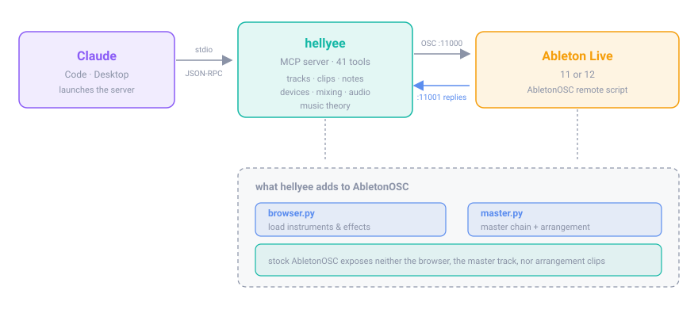

<div align="center">

# hellyee

**Make music in Ableton Live by talking to Claude.**

Create tracks, load instruments and effects, write MIDI, quantize, design sounds,
balance the mix, and arrange a full song — from a conversation.

[](LICENSE)
[](https://www.ableton.com)
[](https://modelcontextprotocol.io)
[](https://python.org)

</div>

---

<!-- Record this per docs/RECORDING.md, then delete this comment.
<p align="center"></p>
-->

```
you  →  "add a MIDI track called Bass, put Wavetable on it,
          write a rolling bassline in F minor, then close the filter a bit"

Claude →  creates the track · loads the instrument · writes 40 notes ·
          reads the filter's real range · sets cutoff · reports back "453 Hz"
```

## What it does

| | |
|---|---|
| **Tracks & clips** | Create MIDI/audio tracks, rename, duplicate, delete. Create clips, fire them, set loop points. |
| **MIDI** | Write, read, replace and clear notes. Quantize with a `strength` control Live's own dialog doesn't offer. |
| **Sound design** | Full parameter access to every Live device — 93 parameters on Wavetable, all of EQ Eight, filters, envelopes. |
| **Devices** | Search Live's browser and load any instrument, effect or preset onto any track. |
| **Mixing** | Read real output meters and balance by measurement, not by guessing. |
| **Arrangement** | Read an existing song's structure, and place clips on the timeline to build your own. |
| **Automation** | Write parameter envelopes — filter sweeps through a build, anything that moves over time. |
| **Master bus** | Load and control devices on the master track. |
| **Music theory** | 13 scales, 14 chord types, key-aware note spelling (F minor gives you `Ab`, not `G#`). |
| **Audio in** | Turn a hummed melody into MIDI, or a spoken command into text. |

48 tools in total. [Full reference below.](#tools)

## How it works

<p align="center"></p>

Claude launches `hellyee` as a subprocess and talks to it over MCP. hellyee
speaks OSC to [AbletonOSC](https://github.com/ideoforms/AbletonOSC), a remote
script running inside Live's own Python, which drives the Live Object Model.

Stock AbletonOSC exposes a lot, but not the browser, the master track, or
arrangement clips. hellyee ships handlers that add all three, plus a patcher
that installs them.

---

## Install

### 1. Run the installer

If you have [uv](https://docs.astral.sh/uv/) — no Python setup needed at all:

```bash
uvx hellyee setup
```

Otherwise:

```bash
pip install hellyee
hellyee setup
```

<details>
<summary><b>Don't have uv?</b> One line.</summary>

```bash
curl -LsSf https://astral.sh/uv/install.sh | sh     # macOS · Linux
powershell -c "irm https://astral.sh/uv/install.ps1 | iex"   # Windows
```

uv downloads its own Python, so you never install or manage one.
</details>

`hellyee setup` downloads AbletonOSC, patches it with the browser / master /
arrangement handlers, and writes your Claude config. It is idempotent — run it
again any time. Use `--client desktop` for Claude Desktop, or `--client both`.

Want the audio features (hum-to-MIDI, voice commands)? They add ~380 MB, so
they are opt-in:

```bash
pip install "hellyee[audio]"
```

### 2. Set up Live

**This step is manual — Live has no API for enabling its own control surfaces.**

1. **Quit and reopen Live.** Remote Scripts are only scanned at startup.
2. Open settings:
   - Live 12: **Settings → Link, Tempo & MIDI**
   - Live 11: **Preferences → Link/Tempo/MIDI**
   - `Cmd + ,` on macOS · `Ctrl + ,` on Windows
3. In the **Control Surface** table, pick **AbletonOSC** in the first free row.
4. Leave **Input** and **Output** as `None` — it communicates over the network,
   not MIDI ports.
5. You should see `AbletonOSC: Listening for OSC on port 11000` in Live's status
   bar.

Once only. Live remembers it.

### 3. The skill

The repo ships a skill at `.claude/skills/hellyee/` that teaches Claude how to
drive these tools well — the ordering rules, the parameter conventions, the
measurement method, and the handful of Live behaviours that fail silently.
Claude Code picks it up automatically when you open this directory.

It is worth reading yourself: it is a condensed map of what goes wrong and why.

### 4. Check it

With Live open:

```bash
hellyee doctor     # connection, handlers, optional features
hellyee smoke      # full end-to-end test, cleans up after itself
```

`smoke` creates a real track, writes and quantizes notes, and loads an
instrument, then deletes the track. Pass `--keep` to leave it in place.

---

## Using it

Say what you want. Claude reads the set's state first, then acts.

```
"make a 4-bar house beat at 124 BPM"
"add a MIDI track called Bass and put Wavetable on it"
"write a rolling bassline in F minor, offbeat eighths"
"quantize that to 16ths at 0.7 strength so it still breathes"
"put an Auto Filter on the bass and close it down a bit"
"this lead is harsh — round off the highs and slow the attack"
"balance the mix, kick should sit on top"
"arrange this into a full track: intro, build, drop, breakdown, drop, outro"
"sweep the filter open across the last 8 bars before the drop"
```

<!-- <p align="center"></p> -->

### Conventions worth knowing

**Time is in beats.** One 4/4 bar is 4 beats; a 16th note is `0.25`.

**Pitches use Live's display convention: C3 = 60.** Standard MIDI notation calls
that C4. hellyee follows Live so the note Claude writes matches the note you see.

**Device parameters are set by percent, not by unit.** Live's raw values live on
internal scales that are not what the UI shows — Auto Filter's `Frequency` runs
`20–135` but reads as "265 Hz". Set parameters with `percent` (0–100 across the
parameter's own range); the tool reports back the displayed value so you can
confirm what actually happened.

---

## Tools

<details>
<summary><b>All 48 tools</b></summary>

| Group | Tools |
|---|---|
| Connection | `check_connection` |
| Song | `get_song_status` · `set_tempo` · `transport` · `create_scene` · `fire_scene` |
| Tracks | `create_track` · `rename_track` · `delete_track` · `duplicate_track` · `set_mixer` |
| Clips | `create_clip` · `delete_clip` · `fire_clip` · `stop_clip` · `set_clip_properties` |
| Notes | `get_clip_notes` · `add_notes` · `replace_clip_notes` · `clear_clip_notes` · `quantize_clip` |
| Theory | `get_scale_notes` · `get_chord_notes` · `snap_notes_to_scale` · `get_drum_map` |
| Devices | `list_track_devices` · `list_device_parameters` · `set_device_parameter` · `delete_device` |
| Browser | `browser_categories` · `search_browser` · `load_device` · `load_device_by_uri` |
| Mixing | `measure_track_level` · `get_master_meter` |
| Master | `list_master_devices` · `list_master_device_parameters` · `set_master_parameter` · `load_master_device` |
| Arrangement | `place_in_arrangement` · `get_arrangement_clips` · `clear_arrangement_track` · `delete_arrangement_clip` · `show_arrangement_view` |
| Automation | `automate_clip` · `clear_clip_automation` |
| Audio | `notes_from_audio` · `transcribe_audio` |

</details>

---

## Audio input

Claude's API does not accept audio, so audio is processed locally and reaches
the model as text or JSON:

| You provide | Processed with | Claude receives |
|---|---|---|
| A spoken command | Whisper | Text |
| A hummed melody | `librosa.pyin` pitch tracking | A note list |

`notes_from_audio` is **monophonic only** — humming, single-note lines. It will
not transcribe chords or a full mix; use a polyphonic model such as
[basic-pitch](https://github.com/spotify/basic-pitch) for that.

On Apple Silicon, `pip install mlx-whisper` makes transcription much faster;
hellyee prefers it when present. The first run downloads a model (~500 MB).

---

## Known limitations

**Claude cannot hear.** It can measure output levels through Live's meters and
reason about frequency ranges, but it cannot judge tone. EQ and sound-design
choices come from convention and measurement — the final call is your ears.

**Third-party plugins are opaque.** Live does not expose VST/AU parameters to
the API until you expose them by hand. Serum, Vital and friends will load and
play, but Claude sees one parameter: `Device On`. To unlock a plugin, hit
**Configure** on its device header, click the knobs you want controllable, then
exit Configure — those parameters then appear.

**Metering runs at ~10 Hz.** AbletonOSC processes on a 100 ms tick, so meters
measure sustained level, not transient peaks.

**Quantize is client-side.** Notes are read, snapped in Python, written back.
That is why `strength` exists — but it costs a round trip rather than being
instant.

**Automation must start in a session clip.** Live only creates envelopes on
session clips, so hellyee writes automation there and carries it into the
arrangement when the clip is placed. To vary automation across sections, write
several clip variants and place the right one in each.

**Session clips override the arrangement.** If a track has ever had a session
clip fired, it ignores arrangement clips until Back to Arrangement is pressed.
hellyee handles this, but it is worth knowing when something plays silently.

**No undo grouping.** Each operation is its own step in Live's undo history.

---

## Development

```
hellyee/
  osc.py            OSC client — persistent socket, request/response matching
  core.py           Live operations as plain functions (no Claude dependency)
  music.py          scales, chords, quantization, key-aware spelling
  audio.py          audio → notes, speech → text
  mcp_server.py     MCP tool layer
  cli.py            connection tests and diagnostics
abletonosc_patch/
  browser.py        adds browser access to AbletonOSC
  master.py         adds master track + arrangement to AbletonOSC
  setup_cli.py      installer: download, patch, configure Claude
abletonosc_patch/
  → shipped inside the wheel as hellyee/_patch
.claude/skills/hellyee/
  SKILL.md          how to drive the tools; loaded by Claude Code
```

Working on hellyee itself:

```bash
git clone https://github.com/guvense/hellyee.git && cd hellyee
uv sync --extra audio          # or: pip install -e ".[audio]"
hellyee setup                  # re-applies the patch from your working copy
```

`core.py` holds the logic and knows nothing about Claude, so it is testable on
its own and drivable from any front end. `mcp_server.py` is a thin layer of
tool definitions over it.

> ⚠️ **Editing anything in `abletonosc_patch/`?** Those files run inside Live,
> which embeds **Python 3.7**. Walrus operators (`:=`), builtin generics
> (`list[str]`) and `X | Y` unions will not parse. The patcher does not check
> this for you — but `python -c "import ast; ast.parse(open('file').read(),
> feature_version=(3,7))"` does.

**Hot reload.** Editing an already-loaded handler does not need a Live restart —
send `/live/api/reload` and it picks up the change in seconds. Adding a *new*
module does require a restart, which is why browser and master handlers each
live in one file.

### Contributing

Issues and pull requests welcome. Useful directions:

- Polyphonic audio-to-MIDI (`basic-pitch`)
- Return tracks and sends
- Windows testing (developed on macOS)
- Genre templates and arrangement patterns for the skill

## Credits

Built on [AbletonOSC](https://github.com/ideoforms/AbletonOSC) by Daniel Jones,
which does the hard work of exposing Live's Object Model over OSC.

## License

[MIT](LICENSE)
# hellyee
